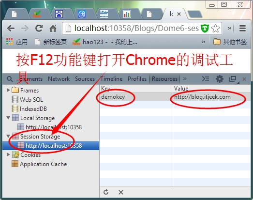

# HTML5 - 存储API

[HTML（超文本标记语言） | MDN (mozilla.org)](https://developer.mozilla.org/zh-CN/docs/Web/HTML)

**一个网站如何能在客户的浏览器存储更多的数据呢？**

> 在Html4的时代在浏览器端存储点网站个性化的数据，尤其是用户浏览器的痕迹，用户的相关数据等一般只能存储在Cookie中，但是大多是浏览器对于Cookie的限制也就逼迫网站存储数据尽量精简，想存储复杂的、关系型的用户数据就根本不可能了。但是进入Html5时代，这一切都不叫事...

 

**一、本地存储由来的背景**

> 众所周知Html4时代Cookie的大小、格式、存储数据格式等限制，网站应用如果想在浏览器端存储用户的部分信息，那么只能借助于Cookie。但是Cookie的这些限制，也就导致了Cookie只能存储一些ID之类的标识符等简单的数据，复杂的数据就更别扯了。

**下面是Cookie的限制：**

- 1, 大多数浏览器支持最大为 4096 字节的 Cookie。

- 2, 浏览器还限制站点可以在用户计算机上存储的 Cookie 的数量。大多数浏览器只允许每个站点存储 20 个 Cookie；如果试图存储更多 Cookie，则最旧的 Cookie 便会被丢弃。

- 3, 有些浏览器还会对它们将接受的来自所有站点的 Cookie 总数作出绝对限制，通常为 300 个。

- 4, Cookie默认情况都会随着Http请求发送到后台服务器，但并不是所有请求都需要Cookie的，比如：js、css、图片等请求则不需要cookie。

> Html5的设计者们，一开始就为Html5能成为富客户端做好了准备。为了破解Cookie的一系列限制，Html5通过JS的新的API就能直接存储大量的数据到客户端浏览器，而且支持复杂的本地数据库，让JS简直就是逆天了。Html5支持两种的WebStorage，一种是永久性的本地存储（localStorage），另外一种是会话级别的本地存储（sessionStorage）。


**二、会话级别的本地存储：sessionStorage**

> 在Html5中增加了一个Js对象：sessionStorage；通过此对象可以直接操作存储在浏览器中的会话级别的WebStorage。存储在sessionStorage中的数据首先是Key-Value形式的，另外就是它跟浏览器当前会话相关，当会话结束后，数据会自动清除，跟未设置过期时间的Cookie类似。

sessionStorage提供了四个方法来辅助我们进行对本地存储做相关操作。

•（1）setItem(key,value)：添加本地存储数据。两个参数，非常简单就不说了。

•（2）getItem(key):通过key获取相应的Value。

•（3）removeItem(key):通过key删除本地数据。

•（4）clear():清空数据。

```js
<script type="text/javascript">
        //添加key-value 数据到 sessionStorage
        sessionStorage.setItem("demokey", "http://blog.itjeek.com");
        //通过key来获取value
        var dt = sessionStorage.getItem("demokey");
        alert(dt);
        //清空所有的key-value数据。
        //sessionStorage.clear();
        alert(sessionStorage.length);
    </script>
```

> 对于JS的学习和调试必须得有Chrome的调试工具辅助才能事半功倍。当然Chrome也是我最喜爱的Web开发辅助工具，非常简单F12快捷键就立即打开工具了，包括IE也是这个快捷键。通过下图就可以查看当前浏览器中的sessionStorage数据。

 

 

**三、永久本地存储：localStorage**

> 在最新的JS的API中增加了localStorage对象，以便于用户存储永久存储的Web端的数据。而且数据不会随着Http请求发送到后台服务器，而且存储数据的大小机会不用考虑，因为在HTML5的标准中要求浏览器至少要支持到4MB.所以，这完全是颠覆了Cookie的限制，为Web应用在本地存储复杂的用户痕迹数据提供非常方便的技术支持。那接下里分别介绍一下localStorage的常用的方法，当然基本上跟sessionStorage是一致的。

localStorage提供了四个方法来辅助我们进行对本地存储做相关操作。

•（1）setItem(key,value)：添加本地存储数据。两个参数，非常简单就不说了。

•（2）getItem(key):通过key获取相应的Value。

•（3）removeItem(key):通过key删除本地数据。

•（4）clear():清空数据。

```html
  <script type="text/javascript">
        //添加key-value 数据到 sessionStorage
        localStorage.setItem("demokey", "http://blog.itjeek.com");
        //通过key来获取value
        var dt = localStorage.getItem("demokey");
        alert(dt);
        //清空所有的key-value数据。
        //localStorage.clear();
        alert(localStorage.length);
    </script>
```


**四、逆天了本地数据库**

> 虽然Html5已经提供了功能强大的localStorage和sessionStorage，但是他们两个都只能提供存储简单数据结构的数据，对于复杂的Web应用的数据却无能为力。逆天的是Html5提供了一个浏览器端的数据库支持，允许我们直接通JS的API在浏览器端创建一个本地的数据库，而且支持标准的SQL的CRUD操作，让离线的Web应用更加方便的存储结构化的数据。接下里介绍一下本地数据的相关API和用法。

操作本地数据库的最基本的步骤是：

•第一步：openDatabase方法：创建一个访问数据库的对象。

•第二步：使用第一步创建的数据库访问对象来执行transaction方法，通过此方法可以设置一个开启事务成功的事件响应方法，在事件响应方法中可以执行SQL.

•第三步：通过executeSql方法执行查询，当然查询可以是：CRUD。

接下来分别介绍一下相关的方法的参数和用法。

 

**（1）openDatabase方法：**

//Demo：获取或者创建一个数据库，如果数据库不存在那么创建之

var dataBase = openDatabase("student", "1.0", "学生表", 1024 * 1024, function () { });

openDatabase方法打开一个已经存在的数据库，如果数据库不存在，它还可以创建数据库。几个参数意义分别是：

•1，数据库名称。

•2，数据库的版本号，目前来说传个1.0就可以了，当然可以不填；

•3，对数据库的描述。

•4，设置分配的数据库的大小（单位是kb）。

•5，回调函数(可省略)。

初次调用时创建数据库，以后就是建立连接了。

**（2）db.transaction方法可以设置一个回调函数，此函数可以接受一个参数就是我们开启的事务的对象。然后通过此对象可以进行执行Sql脚本，跟下面的步骤可以结合起来。**

**（3）通过executeSql方法执行查询。**

ts.executeSql(sqlQuery,[value1,value2..],dataHandler,errorHandler)

参数说明：

•qlQuery：需要具体执行的sql语句，可以是create、select、update、delete；

•value1,value2..]：sql语句中所有使用到的参数的数组，在executeSql方法中，将s>语句中所要使用的参数先用“?”代替，然后依次将这些参数组成数组放在第二个参数中

•ataHandler：执行成功是调用的回调函数，通过该函数可以获得查询结果集；

•4,errorHandler：执行失败时调用的回调函数；

 

下面是一个综合的例子，可以看一下： 

```html
<html>
<head>
 	<script src="./jquery-1.5.1.js" type="text/javascript"></script>
    <script type="text/javascript">
        function initDatabase() {
            var db = getCurrentDb();//初始化数据库
            if(!db) {alert("您的浏览器不支持HTML5本地数据库");return;}
            db.transaction(function (trans) {//启动一个事务，并设置回调函数
                //执行创建表的Sql脚本
                trans.executeSql("create table if not exists Demo(uName text null,title text null,words text null)", [], function (trans, result) {
                }, function (trans, message) {//消息的回调函数alert(message);});
            }, function (trans, result) {
            }, function (trans, message) {
            });
        }
        $(function () {//页面加载完成后绑定页面按钮的点击事件
            initDatabase();
            $("#btnSave").click(function () {
                var txtName = $("#txtName").val();
                var txtTitle = $("#txtTitle").val();
                var txtWords = $("#txtWords").val();
                var db = getCurrentDb();
                //执行sql脚本，插入数据
                db.transaction(function (trans) {
                    trans.executeSql("insert into Demo(uName,title,words) values(?,?,?) ", [txtName, txtTitle, txtWords], function (ts, data) {
                    }, function (ts, message) {
                        alert(message);
                    });
                });
                showAllTheData();
            });
        });
        function getCurrentDb() {
            //打开数据库，或者直接连接数据库参数：数据库名称，版本，概述，大小
            //如果数据库不存在那么创建之
            var db = openDatabase("myDb", "1.0", "it's to save demo data!", 1024 * 1024); ;
            return db;
        }
        //显示所有数据库中的数据到页面上去
        function showAllTheData() {
            $("#tblData").empty();
            var db = getCurrentDb();
            db.transaction(function (trans) {
                trans.executeSql("select * from Demo ", [], function (ts, data) {
                    if (data) {
                        for (var i = 0; i < data.rows.length; i++) {
                            appendDataToTable(data.rows.item(i));//获取某行数据的json对象
                        }
                    }
                }, function (ts, message) {alert(message);var tst = message;});
            });
        }
        function appendDataToTable(data) {//将数据展示到表格里面
            //uName,title,words
            var txtName = data.uName;
            var txtTitle = data.title;
            var words = data.words;
            var strHtml = "";
            strHtml += "<tr>";
            strHtml += "<td>"+txtName+"</td>";
            strHtml += "<td>" + txtTitle + "</td>";
            strHtml += "<td>" + words + "</td>";
            strHtml += "</tr>";
            $("#tblData").append(strHtml);
        }
    </script>
</head>
    <body>
        <table>
            <tr>
                <td>用户名：</td>
                <td><input type="text" name="txtName" id="txtName" required/></td>
            </tr>
               <tr>
                <td>标题：</td>
                <td><input type="text" name="txtTitle" id="txtTitle" required/></td>
            </tr>
            <tr>
                <td>留言：</td>
                <td><input type="text" name="txtWords" id="txtWords" required/></td>
            </tr>
        </table>
        <input type="button" value="保存" id="btnSave"/>
        <hr/>
        <input type="button" value="展示所哟数据" onclick="showAllTheData();"/>
        <table id="tblData">
        </table>
    </body>
</html>
```

